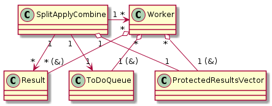

# Ejercicio 2: Split-Apply-Combine
## Taller de Programación I

**Matias Charrut** - 101137

[Link al repositorio](https://github.com/mati1297/tp2_taller1)

## Descripcion

El ejercicio consistió en el armado de un programa el cual procesa un archivo de datos utilizando la técnica de Split-Apply-Combine. Para ello el archivo es cargado en memoria en fragmentos (con tamaños dados por el usuario), luego se procesa cada uno de estos fragmentos por separado y luego se combinan los resultados parciales para obtener un resultado final. Este programa además es implementado de forma *multithreading* de manera que las particiones son cargadas y procesadas en paralelo por los distintos *threads* que lanza el programa.


### Diagrama de flujo

En el siguiente diagrama de flujo se puede ver a grandes rasgos como es el funcionamiento del programa. El *main thread* lanza los *threads* al comienzo, y luego lee desde la entrada *standard* las tareas a realizar, y a medida que lo hace carga las tareas, va cargando las particiones y llena la cola con los *tokens* con los quehaceres que le corresponde. A la vez que ocurre esto, los distintos *threads* se encargan de revisar la cola, tomar los *tokens*, y procesar las particiones.

Una vez que no hay mas entradas, el *main thread* le indica mediante *tokens* de finalizacion a los *threads*  y espera que terminen. Luego imprime los resultados y termina el programa.

<p align=center>
    
</p>

### Clases

El programa se ejecuta a traves de la clase principal ```SplitApplyCombine```, la cual posee un método principal ```execute()``` el cual es ejecutado por el ```main```, quien le pasa los parámetros que recibe por linea de comandos al constructor de la clase. Este método se encarga de inicializar los *threads* y lanzarlos, inicializar la cola de quehaceres y el vector de resultados y  llamar a la clase que lee e inicializa las tareas y llamar a las propias tareas para que carguen la cola. Finalmente manda finalizar los *threads* y espera a que terminen, para luego imprimir los resultados obtenidos y terminar.

Los *threads* ejecutan al *functor* ```Worker```, el cual tiene sobrecargado el operador ```()```, por lo que es un objeto llamable. ```Worker``` posee referencias a instancias de la cola (```ToDoQueue```) y del vector de resultados (```ProtectedResultsVector```). Su método ```run()``` (llamado por el operador ```()```) se encarga de leer *tokens* de la cola de quehaceres, cargar la información que estos poseen y luego procesarla para guardarla en la posicion del vector de resultados que corresponda.

La clase ```Task``` representa una tarea a realizar, equivalente a una linea de entrada por ```stdin```. Esta clase tiene como atributo las filas que debe leer, un puntero al operador que debe utilizar y cuantas filas y columnas tiene cada partición. Su método principal es ```loadQueue()```, que se encarga de cargar las particiones de datos, armar los *tokens* para los *workers* y agregarlos a la cola.

La clase ```TaskReader``` se encarga de leer los datos desde la entrada estandar y configurar los parámetros de un objeto ```Task``` que devuelve su metodo ```read()```.

Los *tokens* se representan mediante la clase ```ToDoToken```, estos poseen los datos a procesar (un objeto ```DataPartition```), la operacion que se debe realizar y el indice donde se debe guardar el resultado. Son inicializados y cargados por la clase ```Task``` y agregados a la ```ToDoQueue```.

La cola ```ToDoQueue``` es un monitor de un objeto ```queue``` que lo convierte en una cola bloqueante y limitada. Esta cola no permite cargar mas de la cantidad que se le indique de *tokens* en ella, y al llegarse al máximo, bloquea. Lo mismo ocurre cuando se encuentra vacia y se quiere obtener un elemento, la cola se bloquea hasta que se cargue algun elemento.

La clase ```DataPartition``` representa las particiones que cargan los distintos *workers*, esta está formada por un vector de vectores de ```uint16_t```, está organizado de manera tal que primero se accede a las columnas, por comodidad a la hora de procesar. Esta clase posee un método de carga ```load()```, el cual carga de a un ```uint16_t``` por vez, este método ese ejecutado por la clase ```DataLoader```. 

Cuando una partición se llena, esta prende un *flag* y de esta manera no puede ser vuelta a cargar hasta que se resetee manualmente. De esta manera el *loader* solo tiene que cargarla hasta que esta esté llena y no preocuparse por el tamaño de la misma. Si no hay suficientes datos para cargar la partición, el *loader* cierra manualmente la partición llamando a su método ```close()```. Una partición al ser cerrada sin cargar totalmente efectua las siguientes acciones: si una fila quedó a medio llenar, se completa con ceros; luego, si quedaron filas totalmente vacias, estas se quitan, esto está asegurado que sucederá una sola vez por tarea, y simplifica de manera sustancial el manejo de estos casos a la hora del procesamiento.

La clase ```DataLoader``` es, como se dijo antes, la encargada de leer y cargar los datos en las particiones, para ello posee una instancia de la clase ```ifstream```.

Los operadores son representados mediante la clase ```Operator```, la cual es abstracta, ya que no tiene implementada la totalidad de sus métodos. Las clases de operadores disponibles son: ```Sum```, ```Min```, ```Max``` (todas estas herederas de ```Operator```) y ```Mean``` (heredera de ```Sum```). Estas objetos son instanciados por ```TaskReader``` y este pasa como parámetro a las tareas un puntero a la operación que corresponda. Poseen métodos tanto para procesar las columnas de las particiones como para operar entre sí. Si bien una misma instancia de un objeto ```Operator``` (o de sus hijas) es compartido por varios *threads*, este no es protegido ya que todos sus métodos son ```const``` y no hay un problema de escritura, por lo que no existe una *race condition*. A continuación se muestra un diagrama que detalla las herencias entre operadores y que métodos implementan y reimplementan cada una de las clases.

<p align=center>
    
</p>

Los resultados son representados por la clase ```Result```, la cual tiene como atributo un número (```uint16_t```), un extra (```uint32_t```, utilizado por ```Mean``` para contabilizar la cantidad de números procesados) y un separador, que define el formateo al imprimir. Si es cargado un separador, el resultado se imprimirá como ```%numero%separador%extra```, sin embargo, de ser el separador una cadena vacia, se imprimirá solo el número. Esta clase está protegida mediante exclusión mutua, ya que ciertas instancias son accedidas a la vez por distintos *threads workers*.


A continuación se puede ver un diagrama de los recursos protegidos compartidos por el *main thread* y los *workers*, el primero es representado por la clase ```SplitApplyCombine```, la cual tiene como atributo al ```ProtectedResultsVector``` e instancia un ```ToDoQueue``` y varios ```Result```. A estos accede ```Worker```, el cual cada uno de ellos tiene referencias a varias instancias de ```Result```, a una de ```ToDoQueue``` y a una de ```ProtectedResultsVector```.

<p align=center>
    
</p>

Para mas información acerca de las clases y sus métodos, revisar la documentación en el código.


